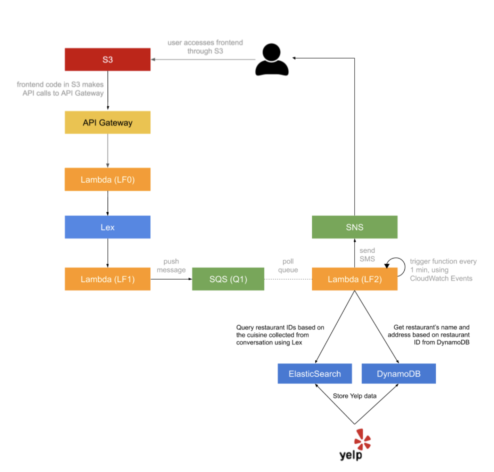

# COMSE6998 Assignment 1: Dining Concierge Chat Bot #

## About ##
Name: Yiwen Fang | UNI: yf2560

## Introduction ##
Customer Service is a core service for a lot of businesses around the world and it is getting disrupted at the moment by Natural Language Processing-powered applications. In this first assignment, implement a serverless, microservice-driven web application. Specifically, build a Dining Concierge chatbot that sends restaurant suggestions given a set of preferences that a user provide the chatbot with through conversation.

Amazon S3 Endpoint: http://myawsbucket-comse6998-assignment1.s3-website-us-east-1.amazonaws.com

## Architecture

## Note
- Including
    - Frontend Code
    - Exported Lambda functions
    - Utility Scripts
    - README
    - Swagger File

- LF3: Send SMS for previous restaurant recommendation

- Cuisines: Chinese, Japanese, Italian, Mexican, Thai

- Input phone number to retrieve a recommendation of previous search
